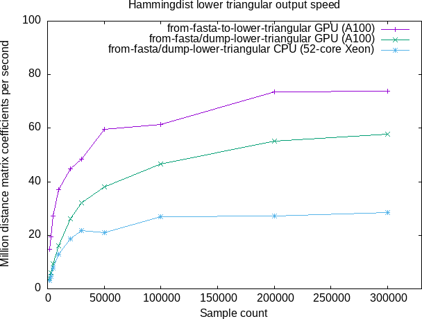
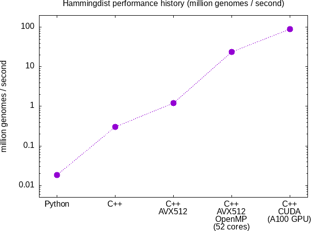

A small and fast C++ tool to calculate pairwise distances between gene sequences given in fasta format.

[](https://zenodo.org/badge/latestdoi/308676358)
[](https://pypi.org/project/hammingdist)
[](https://pypi.org/project/hammingdist)

# Python interface

To use the Python interface, you should install it from PyPI:

```bash
python -m pip install hammingdist
```

## Distances matrix

Then, you can e.g. use it in the following way from Python:

```python
import hammingdist

# To see the different optional arguments available:
help(hammingdist.from_fasta)

# To import all sequences from a fasta file
data = hammingdist.from_fasta("example.fasta")

# To import only the first 100 sequences from a fasta file
data = hammingdist.from_fasta("example.fasta", n=100)

# To import all sequences and remove any duplicates
data = hammingdist.from_fasta("example.fasta", remove_duplicates=True)

# To import all sequences from a fasta file, also treating 'X' as a valid character
data = hammingdist.from_fasta("example.fasta", include_x=True)

# The distance data can be accessed point-wise, though looping over all distances might be quite inefficient
print(data[14,42])
```

## Output formats

The constructed distances matrix can then be written to disk in several different formats:

```python
# The data can be written to disk in csv format (default `distance` Ripser format) and retrieved:
data.dump("backup.csv")
retrieval = hammingdist.from_csv("backup.csv")

# It can also be written in lower triangular format (comma-delimited row-major, `lower-distance` Ripser format):
data.dump_lower_triangular("lt.txt")
retrieval = hammingdist.from_lower_triangular("lt.txt")

# Or in sparse format (`sparse` Ripser format: space-delimited triplet of `i j d(i,j)`
# with one line for each distance entry i > j which is not above threshold):
data.dump_sparse("sparse.txt", threshold=3)

# If the `remove_duplicates` option was used, the sequence indices can also be written.
# For each input sequence, this prints the corresponding index in the output:
data.dump_sequence_indices("indices.txt")

# The lower-triangular distance elements can also be directly accessed as a 1-d numpy array:
lt_array = data.lt_array
# The elements in this array correspond to the 2-d indices (row=1,col=0), (row=2,col=0), (row=2,col=1), ...
# These indices can be generated using the numpy tril_indices function, e.g. to construct the lower-triangular matrix:
lt_matrix = np.zeros((n_seq, n_seq))
lt_matrix[np.tril_indices(n_seq, -1)] = lt_array
```

## Duplicates

When `from_fasta` is called with the option `remove_duplicates=True`, duplicate sequences are removed before constructing the differences matrix.

For example given this set of three input sequences:

| Index | Sequence |
| ----- | -------- |
| 0     | ACG      |
| 1     | ACG      |
| 2     | TAG      |

The distances matrix would be a 2x2 matrix of distances between `ACG` and `TAG`:
| | ACG | TAG |
| --- | --- | --- |
| ACG | 0 | 2 |
| TAG | 2 | 0 |

The row of the distances matrix corresponding to each index in the original sequence would be:

| Index | Sequence | Row in distances matrix |
| ----- | -------- | ----------------------- |
| 0     | ACG      | 0                       |
| 1     | ACG      | 0                       |
| 2     | TAT      | 1                       |

This last column is what is written to disk by `DataSet.dump_sequence_indices`.

It can also be constructed (as a numpy array) without calculating the distances matrix by using `hammingdist.fasta_sequence_indices`

```python
import hammingdist

sequence_indices = hammingdist.fasta_sequence_indices(fasta_file)
```

## Maximum distance values

By default, the elements in the distances matrix returned by `hammingdist.from_fasta` have a maximum value of 255.
You can also set a smaller maximum value using the `max_distance` argument.
For distances larger than this `hammingdist.from_fasta_large` supports distances up to 65535 (but uses twice as much RAM)

## Distances from reference sequence

The distance of each sequence in a fasta file from a given reference sequence can be calculated using:

```python
import hammingdist

distances = hammingdist.fasta_reference_distances(sequence, fasta_file, include_x=True)
```

This function returns a numpy array that contains the distance of each sequence from the reference sequence.

You can also calculate the distance between two individual sequences:

```python
import hammingdist

distance = hammingdist.distance("ACGTX", "AAGTX", include_x=True)
```

## OpenMP on linux

On linux hammingdist is built with OpenMP (multithreading) support, and will automatically make use of all available CPU threads.

## CUDA on linux

On linux hammingdist is also built with CUDA (Nvidia GPU) support.
To use the GPU instead of the CPU, set `use_gpu=True` when calling `from_fasta`. Here we also set the maximum distance to 2:

```python
import hammingdist

data = hammingdist.from_fasta("example.fasta", use_gpu=True, max_distance=2)
```

Additionally, the lower triangular matrix file can now be directly constructed from the fasta file
using the GPU with the `from_fasta_to_lower_triangular` function.
This avoids storing the entire distances matrix in memory and interleaves computation on the GPU with disk I/O on the CPU,
which means it requires less RAM and runs faster.

```python
import hammingdist

hammingdist.from_fasta_to_lower_triangular('input_fasta.txt', 'output_lower_triangular.txt', use_gpu=True, max_distance=2)
```



## Performance history

A rough measure of the impact of the different performance improvements in hammingdist:


